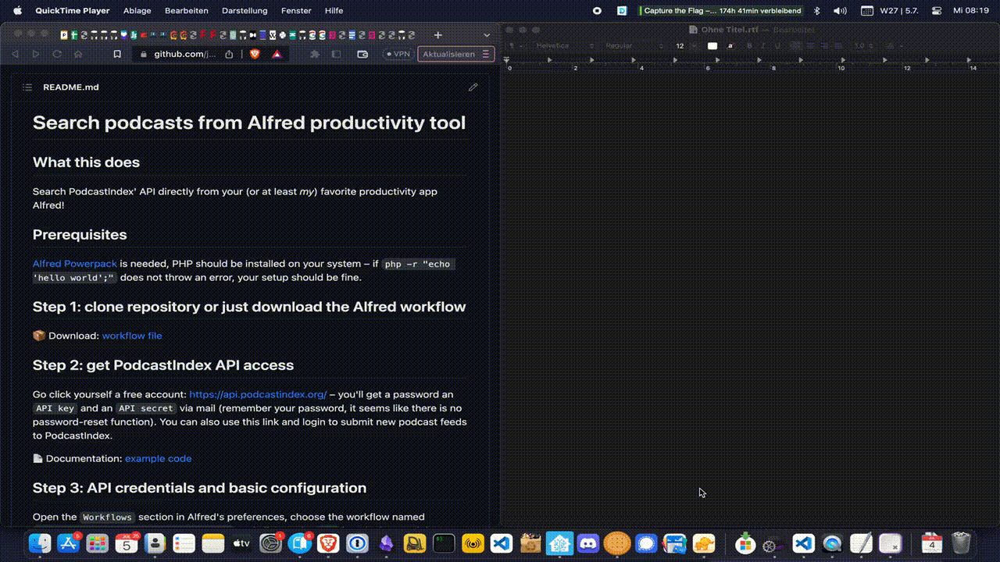

# Alfred Workflow for searching podcasts via PodcastIndex API

## What this does

Search PodcastIndex' API directly from your (or at least _my_) favorite productivity app Alfred!



## Usage

Just open up Alfred, type the keyword `podcast` and then after a space your search term. If the API returns results, you can choose the podcast you were looking for and either hit ...

- ... <kbd>return</kbd>: copy the podcast's feed into your clipboard
- ... <kbd>command</kbd> + <kbd>return</kbd>: copy the podcast's website URL
- ... <kbd>option</kbd> + <kbd>return</kbd>: copy the podcast's cover URL
- ... <kbd>control</kbd> + <kbd>return</kbd>: copy a dump of all meta info the PodcastIndex api provides about a podcast

## Installation
### Prerequisites 

What you need to start (besides Alfred, obviously):
1. 👨‍💻 a working PHP installation on your machine
2. 📦 the actual workflow file from this repository
3. 👤 an account at [PodcastIndex](https://api.podcastindex.org/)
4. 🔐 valid credentials in the workflow  

### 1. regarding: PHP

PHP should be installed on your system – if `php -r "echo 'hello world';"` does not throw an error, your setup should be fine. My recommendation would be to set up PHP via [homebrew](https://crunchify.com/how-to-install-php-latest-version-on-macos/).

You can find the code for this workflow [down below](#This-workflows-PHP-code).

### 2. downloading (and installing)

You can either clone this repository or download only the actual [workflow file](https://github.com/juekr/alfred-podcast-search/raw/main/Search%20podcasts%20via%20PodcastIndex%20API.alfredworkflow). If Alfred is installed on your machine, double clicking on the workflow file should import it into the `Workflows` section in Alfred.

You can easily change the search keyword (default: `podcast`) or extend the functionality.

### 3. getting access to PodcastIndex API

Go click yourself a free account: <https://api.podcastindex.org/> – you'll get a password an `API key` and an `API secret` via mail (remember your password, it seems like there is no password-reset function). You can also use this link and login to submit new podcast feeds to PodcastIndex.

📄 Documentation: [example code](https://podcastindex-org.github.io/docs-api/#overview--example-code)

### 4. saving API credentials 

Open the `Workflows` section in Alfred's preferences, choose the workflow named `Search podcasts via PodcastIndex API` and click on the `(x)` icon in the top right. Head over to the tab `Environment Variables` and enter your credentials from earlier with the following keys:

```
PODCASTINDEX_API_KEY=
PODCASTINDEX_API_SECRET=
```


## This workflow's PHP code

You should definitely check what the PHP code in the Alfred workflow does ... or you just trust a random stranger from the internet. 

To make things easier for you, here's the relevant code:

```php
<?php
//Required values  
$apiKey = getenv ("PODCASTINDEX_API_KEY"); 
$apiSecret = getenv ("PODCASTINDEX_API_SECRET");
$apiHeaderTime = time();  

// API credentials are obligatory
if (empty($apiKey) || empty($apiSecret)) error("Please provide API credentials!");

// The query is built of all commandline parameters, separated by space (and then url_encoded)
$query = implode(" ", array_slice($argv,1));
if (empty($query)) error("Empty query.");

//Hash them to get the Authorization token  
$hash = sha1($apiKey.$apiSecret.$apiHeaderTime);  

//Set the required headers  
$headers = [  
    "User-Agent: php-podcastindex-query/1.1",  
    "X-Auth-Key: $apiKey",  
    "X-Auth-Date: $apiHeaderTime",  
    "Authorization: $hash"  
];  

//Make the request to an API endpoint  
$ch = curl_init();  
curl_setopt($ch, CURLOPT_URL,"https://api.podcastindex.org/api/1.0/search/byterm?q=".urlencode($query));  
curl_setopt($ch, CURLOPT_RETURNTRANSFER, true);  
curl_setopt($ch, CURLOPT_HTTPHEADER, $headers);  

//Collect and show the results  
$response = curl_exec($ch);  
curl_close ($ch);

$json_result = json_decode($response, true);

if ($json_result["count"] == 0) error($json_result["description"]);

echo json_encode(format_many_for_alfred($json_result));


function error ($msg) {
	$error = [
		"items" => [[
        		"type" => "file",
        		"title" => $msg,
			"arg" => $msg
		]],
		"variables" => [ "error" => true, "message" =>  $msg]
    ];
    echo json_encode($error);
	exit(0);
}

function format_many_for_alfred($results) {
    try {
        if (count($results["feeds"]) == 0) return [];
    } catch(Exception $e) {
        return [];
    }
    $return = ["items" => []];
    foreach ($results["feeds"] as $idx => $result):
        $return["items"][] = format_single_for_alfred($result);
    endforeach;
    return $return;
}

function format_single_for_alfred($item) {
    $summary = "";
    foreach ($item as $key => $value):
        if (!is_array($value)) $summary .= "[$key] => $value\n";
        if (is_array($value)) $summary .= "[$key] => [\n\t".implode(",\n\t", $value)."\n]\n";
    endforeach;
    return [
        "uid" => "pi-".$item["id"],
        "title" => $item["title"],
        "subtitle" => $item["originalUrl"],
        "arg" => $item["originalUrl"],
        "valid" => !empty($item["originalUrl"]),
        "match" => $item["title"],
        "type" => "default",
        "quicklookurl" => $item["link"],
        "text" => [
            "copy" => $item["originalUrl"]." (text here to copy)",
            "largetype" => $item["originalUrl"]. " (text here to large type)",
        ],
        "mods" => [
            "alt" => [
                "valid" => true,
                "arg" => $item["image"],
                "subtitle" => "Copy: ".$item["image"],
            ],
            "cmd" => [
                "valid" => true,
                "arg" => $item["link"],
                "subtitle" => "Copy: ".$item["link"],
            ],
            "ctrl" => [
                "valid" => true,
                "arg" => $summary,
                "subtitle" => "Copy PodcastIndex summary of ".$item["title"],
            ]
        ]
    ];
}
?>
```

By changing the details in the `format_single_for_alfred($item)` function, you can easily adapt the workflow to your specific needs. Have fun!

## ToDo

- [x] clean up README
- [x] add API credentials to workflow variables (but don't export them)
- [ ] provide useful icons for search results
- [ ] use `Configuration Builder` instead of environmental variables
- [ ] add a "do something with the result besides copying it to clipboard" option
- [ ] prevent premature <kbd>return</kbd>

## License

Shield: [![CC BY-NC-SA 4.0][cc-by-nc-sa-shield]][cc-by-nc-sa]

This work is licensed under a

[Creative Commons Attribution-NonCommercial-ShareAlike 4.0 International License][cc-by-nc-sa].

[![CC BY-NC-SA 4.0][cc-by-nc-sa-image]][cc-by-nc-sa]

[cc-by-nc-sa]: <http://creativecommons.org/licenses/by-nc-sa/4.0/>
[cc-by-nc-sa-image]: <https://licensebuttons.net/l/by-nc-sa/4.0/88x31.png>
[cc-by-nc-sa-shield]: <https://img.shields.io/badge/License-CC%20BY--NC--SA%204.0-lightgrey.svg>
